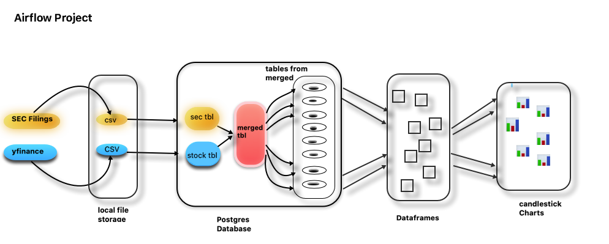

# DataEnginerringAirflow

SEC data source : https://www.sec.gov/cgi-bin/browse-edgar?CIK=tsla&owner=exclude&action=getcompany  
Stock price data source : yahoo finance  

**SEC filings and stock price** 
Example: Tesla stock "TSLA" 

The idea of stock trading is to capitalize on short-term market to sell stocks for profit, or buy at a low. 
There is day trading i.e buy and sell several times throughout the day; and there is active trading one or more  
trades per month. 

Traders do extensive research, spending hours following the market, technical analysis, trends etc. Investors can  
dig deep and discover why results ended up the way they did -- good or bad. But it's hard to get reliable source to  
find out the 'real story' behind what's going on with a company or moves that it is making. 

What are **SEC** Fillings? 
SEC Filings are formal documents that are submitted to the U.S. Securities and Exchange Commission (SEC). All public  
companies are required to make regular SEC filings. Financial professionals and investors rely on SEC filings for investment  
purposes. SEC Filings contain important financial data, disclosures, and events that impact the company.
Because the data contained within SEC filings is sworn to accuracy or audited, it is a much more reliable source. But at the same time  
unless they are a professional traders/investors most people don't really know about sec fillings and important phrases that  
are needed to know to recognize red flags. 

Based on my interest i created an **airflow pipeline**: 
I picked one ticker(**TSLA/Tesla**) and took out 10 years stock price from yahoo finance and it's SEC filling from EDGAR, 
cleaned and stored the data into postgres database, merged the tables in to one and then created tables for each year,  
created a dataframe and a candlestick chart so that they can see when and where the fillings occurred how it impacted  
the price and how long it stayed. 

